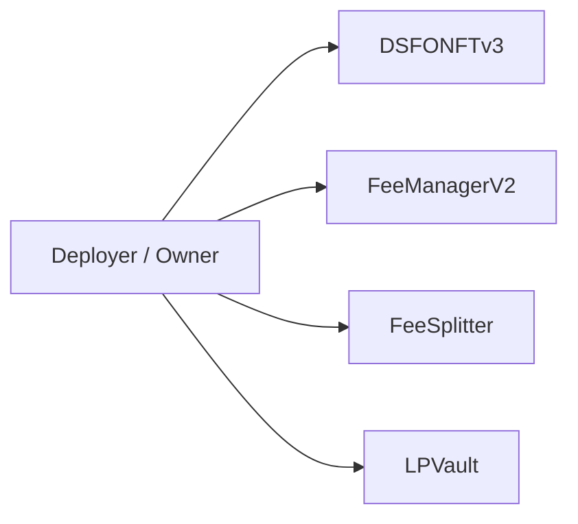
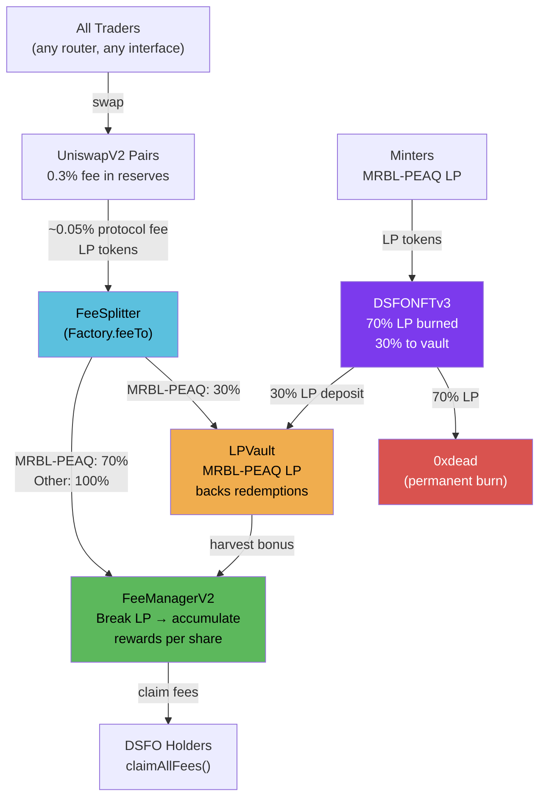

# Architecture

Four contracts. Clean dependency chain. No circular references.

## Contract Ownership

## System Flow

## Inter-Contract Calls

| Caller | Target | Function | When |
|--------|--------|----------|------|
| DSFONFTv3 | FeeManagerV2 | `handleOwnershipChange()` | On every mint/burn — updates holder shares |
| DSFONFTv3 | LPVault | `depositFromMint()` | On mint — registers per-NFT LP deposit |
| DSFONFTv3 | LPVault | `processRedemption()` | On burn — returns time-weighted LP |
| FeeManagerV2 | UniswapV2Router | `removeLiquidity()` | On trigger — breaks LP into underlying tokens |
| FeeSplitter | FeeManagerV2 | `transfer()` (ERC-20) | On distribute — forwards LP tokens |
| FeeSplitter | LPVault | `transfer()` (ERC-20) | On distribute — forwards 30% of MRBL-PEAQ LP |
| LPVault | FeeManagerV2 | `transfer()` (ERC-20) | On harvest — sends DSFO bonus LP |

## Off-Chain Components

### Fee Listener (feesListener_v3.js)

A Node.js background service that:
1. Calls `FeeSplitter.distributeBatch()` to route accumulated LP
2. Computes slippage-protected min amounts from on-chain reserves
3. Calls `FeeManagerV2.triggerBreakdownAndDistribution()` with slippage bounds
4. Snapshots holder balances and records fee batches to the API

Runs as a systemd service (`feeslistener-v3.service`) with auto-restart.

### Backend API

Express.js server that stores historical fee distribution data for the frontend dashboard. The on-chain state is authoritative — the API provides historical context only.

## Security Model

- **Soulbound enforcement**: `_update()` override blocks all transfers except mint (from=0) and burn (to=0)
- **Reentrancy guards**: All state-changing functions use OpenZeppelin `ReentrancyGuard`
- **Pausable**: DSFO minting and redemption can be paused by owner
- **Access control**: Admin functions are `onlyOwner` (intended to be behind timelock in production)
- **Permissionless triggers**: FeeManager trigger and LPVault harvest are callable by anyone (with minimum intervals and bounties)
- **Fee cap**: Trigger bounty capped at 5% max, with absolute cap set by governance
