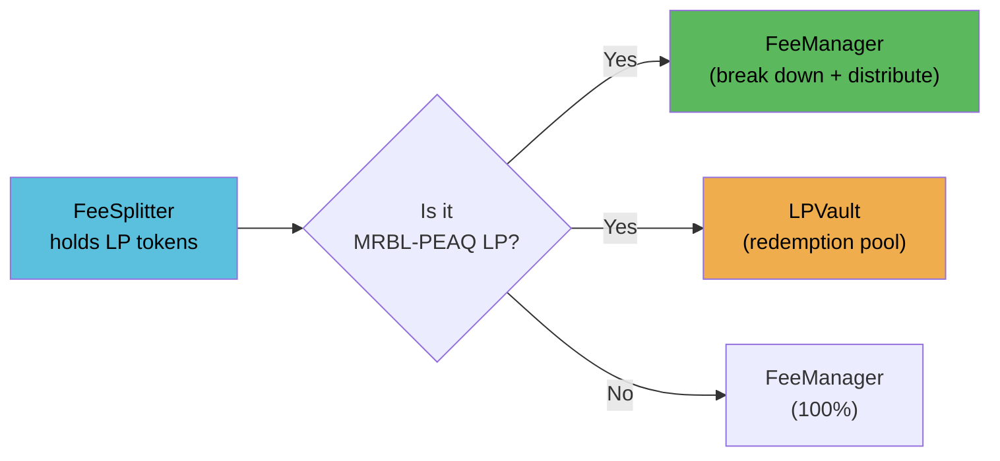

# FeeSplitter

**Address**: [`0xe0a8AdBd3A9c780407A7993343589d7858CB1ba0`](https://peaq.subscan.io/account/0xe0a8AdBd3A9c780407A7993343589d7858CB1ba0?tab=contract)

Sits at `Factory.feeTo`. Receives protocol fee LP tokens from all trading pairs. Routes them based on pair type.

**Inherits**: Ownable

**Source**: `contracts/FeeSplitter.sol`

## How It Receives Fees

The UniswapV2 Pair contract's internal `_mintFee()` function mints protocol fee LP tokens to the `feeTo` address on every swap. Since `Factory.feeTo` is set to the FeeSplitter, it automatically accumulates LP from all pairs.

This is **mandatory and ubypassable** — regardless of which router, aggregator, or frontend is used for the swap, the fee accrues to FeeSplitter. Even direct contract calls and MEV bots pay the same protocol fee.

### Fee Accumulation

Fees don't arrive on every swap. The V2 `_mintFee()` function calculates the accumulated fee since the last mint event and mints LP tokens accordingly. Fees typically accumulate and are minted in bulk when liquidity events (add/remove) occur or when the fee listener triggers distribution.

## Routing Logic



| LP Token | FeeManager | LPVault | Rationale |
|----------|-----------|---------|-----------|
| MRBL-PEAQ LP (`mrblPeaqPair`) | 70% | 30% | Sustain redemption backstop while maximizing holder distributions |
| All other pair LP | 100% | 0% | LPVault only holds MRBL-PEAQ LP; other tokens go entirely to FeeManager for breakdown |

## Constants

| Name | Value | Description |
|------|-------|-------------|
| `BPS_DENOMINATOR` | 10000 | Basis points denominator |

## State Variables

| Variable | Type | Description |
|----------|------|-------------|
| `factory` | IUniswapV2Factory | Factory reference for pair validation |
| `feeManager` | address | Receives majority of fees for breakdown |
| `lpVault` | address | Receives 30% of MRBL-PEAQ LP |
| `mrblPeaqPair` | address | The MRBL-PEAQ pair address for split detection |
| `feeManagerBps` | uint256 | FeeManager share (default 7000 = 70%) |
| `lpVaultBps` | uint256 | LPVault share (default 3000 = 30%) |

## Core Functions

### `distribute(address lpToken)` — permissionless

Distribute accumulated LP tokens for a specific pair.

```solidity
function distribute(address lpToken) external
```

**Process**:
1. Checks `IERC20(lpToken).balanceOf(address(this))`
2. Returns early if balance == 0 (no-op)
3. If `lpToken == mrblPeaqPair`:
   - `toFeeManager = (balance * feeManagerBps) / BPS_DENOMINATOR`
   - `toLPVault = balance - toFeeManager` (avoids rounding dust)
   - Transfers to both contracts
   - Calls `lpVault.depositFromFees(toLPVault)` (requires prior approval)
4. Else:
   - Transfers entire balance to FeeManager
5. Emits `Split(lpToken, toFeeManager, toLPVault)`

### `distributeBatch(address[] calldata lpTokens)` — permissionless

Batch distribute for multiple pairs in one transaction.

```solidity
function distributeBatch(address[] calldata lpTokens) external
```

Called by the [fee listener](/docs/operations/fee-listener) before triggering FeeManager breakdown. Processes each LP token with the same routing logic as `distribute()`.

## Admin Functions (onlyOwner)

| Function | Description | Constraints |
|----------|-------------|-------------|
| `setSplitRatio(uint256 _feeManagerBps, uint256 _lpVaultBps)` | Update split ratios | Must sum to 10000 |
| `setFeeManager(address)` | Update FeeManager address | Non-zero |
| `setLPVault(address)` | Update LPVault address | Non-zero |
| `setMrblPeaqPair(address)` | Update MRBL-PEAQ pair address | Non-zero |

## Events

```solidity
event Split(address indexed lpToken, uint256 toFeeManager, uint256 toLPVault);
event SplitRatioUpdated(uint256 feeManagerBps, uint256 lpVaultBps);
event FeeManagerUpdated(address indexed newFeeManager);
event LPVaultUpdated(address indexed newLPVault);
event MrblPeaqPairUpdated(address indexed newPair);
```

## Integration Notes

- The FeeSplitter must approve `lpVault` to spend MRBL-PEAQ LP (for `depositFromFees`)
- The FeeSplitter must hold LP tokens before `distribute()` is called — it doesn't pull from anywhere
- `Factory.feeTo` must be set to the FeeSplitter address for automatic fee accumulation
- Only the `feeToSetter` address on the Factory can change `feeTo`
