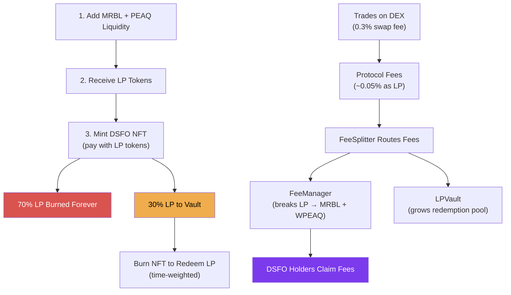

# DonnySwap v3

DonnySwap is a decentralized exchange running on [PEAQ](https://www.peaq.network/) (chain ID 3338), forked from Uniswap V2. It extends the base AMM with a soulbound NFT ownership layer that lets users become fractional owners of the protocol and earn a share of every trade.

## Why DonnySwap?

Most DEX fee-sharing models suffer from one or more of these problems:

- **Governance token dilution** — Inflationary rewards devalue holdings over time
- **Mercenary capital** — Yield farmers enter and exit freely, extracting value without commitment
- **Complex staking** — Lock tokens for arbitrary periods, claim through confusing interfaces
- **Secondary market speculation** — Fee rights get traded, disconnecting ownership from participation

DonnySwap solves these with a different model:

- **Soulbound NFTs** — DSFO tokens can't be transferred. You either hold or burn. No speculation, no claim sniping.
- **Permanent liquidity** — 70% of every mint cost is burned forever. The pool can only get deeper.
- **Automatic fee accumulation** — MasterChef-style accounting means gas-efficient distribution. Claim whenever you want.
- **Self-regulating supply** — The bonding curve prices new mints based on active supply, creating natural equilibrium.

## Core Components

| Component | Purpose |
|-----------|---------|
| **Uniswap V2 DEX** | AMM with Factory + Router. 0.3% swap fee, ~0.05% protocol fee |
| **DSFO NFT v3** | Soulbound (ERC-5192) fractional ownership tokens. No transfers — only mint or burn |
| **FeeManager v2** | Claim-based fee accumulator. Breaks LP into underlying tokens, distributes per-share |
| **LPVault** | Protocol-owned MRBL-PEAQ liquidity. Backs NFT redemptions and earns harvest surplus |
| **FeeSplitter** | Sits at `Factory.feeTo`. Routes protocol fee LP: 70/30 split for MRBL-PEAQ, 100% FeeManager for others |

## Tokens

| Token | Type | Supply | Role |
|-------|------|--------|------|
| **PEAQ** | Native | Inflationary | Gas token and base trading pair |
| **WPEAQ** | ERC-20 | 1:1 wrapped PEAQ | Used inside LP pairs (AMM requires ERC-20) |
| **MRBL** | ERC-20 | 1,000,000 fixed | Required for DSFO minting. Paired with PEAQ for liquidity. |
| **DSFO** | ERC-721 (Soulbound) | Dynamic | Fractional ownership NFT. Entitles holder to protocol fee claims. |

## How It Works

### Step by Step

1. **Get LP tokens** — Add MRBL + PEAQ to the liquidity pool via the DEX router. You receive MRBL-PEAQ LP tokens representing your share of the pool.

2. **Mint DSFO NFTs** — Approve and spend LP tokens to mint soulbound DSFO NFTs. The price follows a [bonding curve](/docs/tokenomics/pricing-curve) — each NFT costs more than the last based on active supply.

3. **LP is split** — 70% of the LP you paid is sent to a dead address (burned permanently). This MRBL and PEAQ remains in the pool forever, deepening liquidity for all traders. The remaining 30% goes to the [LPVault](/docs/contracts/lp-vault), tracked per-NFT for future redemption.

4. **Earn fees** — Every swap on every trading pair generates protocol fees. The [FeeSplitter](/docs/contracts/fee-splitter) routes these fees, and the [FeeManager](/docs/contracts/fee-manager-v2) breaks them down into underlying tokens (MRBL, WPEAQ, etc.) distributed proportionally to all DSFO holders.

5. **Claim anytime** — Visit the Fee Dashboard and call `claimAllFees()`. Your share has been accumulating since your last claim — no lockups, no vesting, no epochs.

6. **Exit by burning** — When you want to leave, burn your DSFO NFT to [redeem LP](/docs/tokenomics/redemption) from the vault. Returns are time-weighted (0% to 80% over 365 days) with a sliding fee (20% down to 3%).

## Key Numbers

| Parameter | Value |
|-----------|-------|
| Swap fee | 0.3% per trade |
| Protocol fee | ~0.05% (1/6 of swap fee, minted as LP) |
| LP burn on mint | 70% (permanent) |
| LP to vault on mint | 30% (redeemable) |
| Max redemption return | 80% of mint cost (after 365 days) |
| Min redemption fee | 3% (after 365 days) |
| Max redemption fee | 20% (day 0) |
| Fee distribution frequency | Every 4 hours (automated) |
| Redemption cooldown | 48 hours per address |
| Max batch mint | 50 NFTs per transaction |
| Max batch redeem | 50 NFTs per transaction |

## Tech Stack

- **Blockchain**: PEAQ (EVM-compatible, chain ID 3338)
- **Contracts**: Solidity 0.8.28, OpenZeppelin 5.x, Hardhat 2.28
- **Frontend**: React 19, Vite 7, viem, styled-components, RainbowKit
- **Backend**: Express API (Node.js), PostgreSQL for historical data
- **Fee Listener**: Node.js service (viem), systemd, QuickNode RPC with ranked fallback
- **Docs**: Mintlify

## Quick Links

- [Architecture & Data Flow](/docs/architecture)
- [Deployed Contract Addresses](/docs/deployed-addresses)
- [Pricing Curve](/docs/tokenomics/pricing-curve)
- [Fee Distribution](/docs/tokenomics/fee-distribution)
- [Redemption Mechanics](/docs/tokenomics/redemption)
- [Contract References](/docs/contracts/dsfo-nft-v3)
- [Deployment Guide](/docs/operations/deployment)
