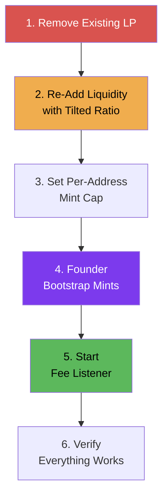

# Bootstrap Plan

After deploying v3 contracts, the pool must be seeded with liquidity and the first DSFO NFTs minted to activate the fee distribution system.

## Bootstrap Sequence



### 1. Remove Existing Liquidity

Remove all deployer-held LP from the MRBL-PEAQ pool:

```bash
npx hardhat run scripts/deploy/remove-liquidity.cjs --network peaq --config hardhat.config.cjs
```

This drains the deployer's LP position, returning MRBL and WPEAQ to the deployer wallet.

**Verify**: Check the deployer's LP balance is 0 on Subscan.

### 2. Re-Add Liquidity with Tilted Ratio

Add liquidity at the target MRBL price point. The ratio of MRBL:PEAQ deposited determines the initial market price.

**Example** for MRBL at ~$0.01 with PEAQ at ~$0.006:

```
MRBL deposit:  5,987 MRBL
PEAQ deposit:  10,000 PEAQ
Implied ratio: 1 MRBL ~ 1.67 PEAQ ~ $0.01
```

The exact amounts should be calculated using `calc-tilt2.cjs`:

```bash
node calc-tilt2.cjs
```

This script models:
- Initial deposit ratio and resulting MRBL price
- DSFO minting demand scenarios (conservative, moderate, aggressive)
- LP burn effects on circulating MRBL supply
- Fee income projections at various trading volumes
- Break-even analysis for minters

**Important**: The first liquidity add sets the price. Subsequent adds/removes adjust it. Get this right before proceeding.

### 3. Set Per-Address Mint Cap

Prevent whale minting during the early phase when the bonding curve is at its cheapest:

```javascript
await dsfoNft.setMaxMintsPerAddress(25);
```

The owner is exempt from this cap for bootstrap minting. The cap can be adjusted or removed later:

```javascript
await dsfoNft.setMaxMintsPerAddress(0); // Removes cap
```

### 4. Founder Bootstrap Mints

Mint initial DSFO NFTs to:
- Seed the holder base (FeeManager needs at least 1 holder to distribute fees)
- Test the full mint flow on mainnet
- Establish initial `activeSupply` for the bonding curve

```javascript
// Get current price
const price = await dsfoNft.batchMintPrice(quantity);
console.log('Total cost:', ethers.formatUnits(price, 18), 'LP');

// Approve LP tokens
await lpToken.approve(dsfoNftAddress, price);

// Mint
await dsfoNft.mint(quantity);
```

**Post-mint verification**:
- Check `activeSupply` matches expected count
- Check `currentMintPrice()` reflects the new supply
- Check LPVault received 30% deposits (`vaultBalance()`)
- Check 70% was burned (LP balance at `0xdead`)
- Check FeeManager tracks the holder (`holderBalances(deployer)`)

### 5. Start Fee Listener

```bash
sudo systemctl start feeslistener-v3
sudo systemctl status feeslistener-v3
```

Wait for the first cycle (up to 4 hours) or trigger manually:

```javascript
// Manual first trigger (no slippage protection)
await feeManager.triggerBreakdownAndDistribution();
```

### 6. Verify

Run through each verification step:

**Fee Pipeline**:
- [ ] FeeSplitter is receiving LP from trades (check balance on Subscan)
- [ ] `distributeBatch()` successfully routes to FeeManager and LPVault
- [ ] FeeManager trigger works (check `FeesAccumulated` events)
- [ ] Fee dashboard shows claimable amounts
- [ ] `claimAllFees()` successfully transfers tokens

**Vault Health**:
- [ ] `vaultBalance()` matches expected deposits
- [ ] `vaultTarget()` is 30% of `totalActiveMintCost`
- [ ] `vaultHealthBps()` returns 10000 (100% healthy)

**Redemption** (test with a sacrificial NFT):
- [ ] `previewRedemption(tokenId)` returns expected values
- [ ] `redeem(tokenId)` returns LP to holder
- [ ] `activeSupply` decrements correctly

**Frontend**:
- [ ] Mint page shows current price and supply
- [ ] Fee Dashboard shows claimable amounts
- [ ] Claim button works
- [ ] Vault health indicator displays correctly

## Post-Bootstrap Operations

After bootstrap is complete:

1. **Monitor first few trigger cycles** — Watch fee listener logs for any errors
2. **Verify fee accumulation** — Check `accRewardPerShare` is increasing on FeeManager
3. **Test a claim** — Claim fees from the Fee Dashboard to verify the full pipeline
4. **Announce** — The protocol is live and accepting mints

## Emergency Procedures

### Pause All Activity

If something goes wrong, pause the DSFO contract:

```javascript
await dsfoNft.pause();
// This prevents all minting and redemption
// Fee claiming on FeeManager is NOT pausable (by design)
```

### Emergency Vault Withdrawal

If LP tokens are stuck or misrouted:

```javascript
await lpVault.emergencyWithdraw(tokenAddress, amount, recipientAddress);
```

### Emergency FeeManager Withdrawal

For non-reward tokens only (reward tokens are protected):

```javascript
await feeManager.emergencyWithdraw(tokenAddress, amount, recipientAddress);
```
