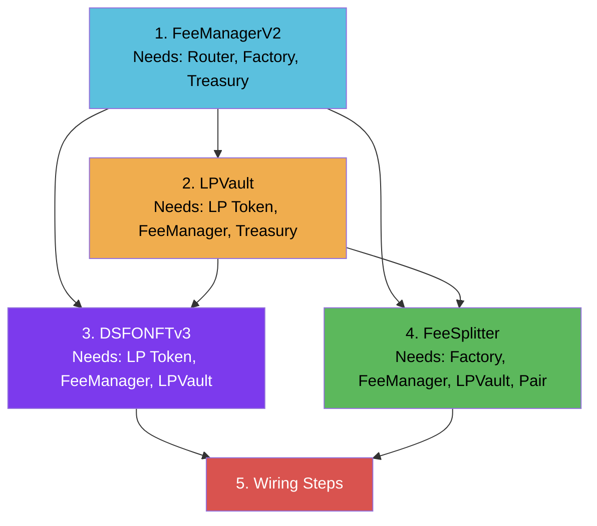

# Deployment

## Prerequisites

- Node.js 18+
- Hardhat 2.28+ (`hardhat.config.cjs`)
- Deployer private key in `.env` as `DEPLOYER_PRIVATE_KEY`
- Sufficient PEAQ for gas (recommend 50+ PEAQ for full deployment + wiring)

## Deployment Order

Contracts must be deployed in this order due to constructor dependencies:



### Step 1: FeeManagerV2

First because it has no dependencies on the other v3 contracts:

```solidity
constructor(
    address _dsfoToken,   // Can be address(0) placeholder — set post-deploy
    address _router,      // UniswapV2Router02
    address _factory,     // SushiSwapFactory
    address _treasury     // Treasury wallet
)
```

### Step 2: LPVault

Needs FeeManager address from step 1:

```solidity
constructor(
    address _mrblPeaqLP,   // MRBL-PEAQ LP pair address
    address _dsfoToken,    // address(0) placeholder — set post-deploy
    address _feeSplitter,  // address(0) placeholder — set post-deploy
    address _feeManager,   // From step 1
    address _treasury      // Treasury wallet
)
```

### Step 3: DSFONFTv3

Needs both FeeManager and LPVault:

```solidity
constructor(
    address _lpToken,      // MRBL-PEAQ LP pair address
    address _feeManager,   // From step 1
    address _lpVault,      // From step 2
    uint256 _basePrice,    // Base mint price in LP wei
    uint256 _priceStep     // Price increment per active NFT in LP wei
)
```

### Step 4: FeeSplitter

Needs FeeManager and LPVault:

```solidity
constructor(
    address _factory,      // SushiSwapFactory
    address _feeManager,   // From step 1
    address _lpVault,      // From step 2
    address _mrblPeaqPair  // MRBL-PEAQ pair address
)
```

## Wiring Steps (Post-Deploy)

After all 4 contracts are deployed, wire them together:

```
1. FeeManager.setDsfoToken(DSFONFTv3)          // So FeeManager accepts mint/burn callbacks
2. LPVault.setDsfoToken(DSFONFTv3)             // So LPVault accepts deposit/redeem calls
3. LPVault.setFeeSplitter(FeeSplitter)          // So LPVault knows who can deposit fees
4. FeeManager.addLPTokenAddress(MRBL-PEAQ Pair) // Register LP for breakdown
5. Factory.setFeeTo(FeeSplitter)                // Route protocol fees to FeeSplitter
```

Step 5 requires the deployer to be the Factory's `feeToSetter`. This is a one-time privileged operation.

## Deploy Script

`scripts/deploy/deploy-v3.cjs` handles both deployment and wiring:

```bash
npx hardhat run scripts/deploy/deploy-v3.cjs --network peaq --config hardhat.config.cjs
```

The script:
1. Deploys all 4 contracts in order
2. Executes all 5 wiring steps
3. Logs deployed addresses
4. Waits for confirmations between steps

## Standalone Wiring Script

If contracts are already deployed but not wired (e.g., after a partial deployment):

```bash
npx hardhat run scripts/deploy/wire-remaining.cjs --network peaq --config hardhat.config.cjs
```

Edit the contract addresses in the script before running.

## Factory.setFeeTo

The Factory's `feeTo` must point to FeeSplitter for protocol fees to flow. Only the `feeToSetter` address can call this:

```javascript
const factory = new ethers.Contract(FACTORY_ADDRESS, factoryAbi, deployer);
await factory.setFeeTo(FEE_SPLITTER_ADDRESS);
```

**Important**: If the deployer is not the `feeToSetter`, this step will revert. Check:

```javascript
const setter = await factory.feeToSetter();
console.log('feeToSetter:', setter);
```

## Hardhat Configuration

```javascript
// hardhat.config.cjs
require("@nomicfoundation/hardhat-toolbox");
require("dotenv").config({ path: "./scripts/deploy/.env" });

module.exports = {
  solidity: {
    version: "0.8.28",
    settings: {
      optimizer: { enabled: true, runs: 200 },
      evmVersion: "cancun",
    },
  },
  networks: {
    peaq: {
      url: "https://quicknode1.peaq.xyz",
      chainId: 3338,
      accounts: [process.env.DEPLOYER_PRIVATE_KEY],
    },
  },
};
```

## Verification

After deployment, verify contracts for transparency:

### Subscan

PEAQ's Subscan explorer supports contract verification. Upload the flattened source and compiler settings.

### Sourcify

```bash
npx hardhat verify --network peaq CONTRACT_ADDRESS "constructor_arg1" "constructor_arg2"
```

Note: Sourcify support on PEAQ may require manual submission at [repo.sourcify.dev](https://repo.sourcify.dev).

## Post-Deployment Checklist

- [ ] All 4 contracts deployed
- [ ] FeeManager.dsfoToken set to DSFONFTv3
- [ ] LPVault.dsfoToken set to DSFONFTv3
- [ ] LPVault.feeSplitter set to FeeSplitter
- [ ] MRBL-PEAQ LP registered in FeeManager
- [ ] Factory.feeTo set to FeeSplitter
- [ ] Contracts verified on Subscan/Sourcify
- [ ] Addresses recorded in `deployed-addresses.mdx`
- [ ] Frontend constants updated (`src/constants/contracts.js`)
- [ ] ABIs updated (`src/ABIs/`)
