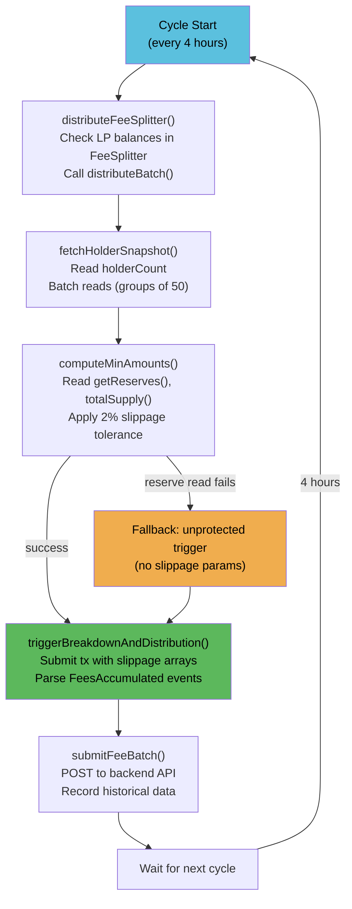

# Fee Listener v3

`scripts/feesListener_v3.js` is the off-chain service that automates the fee distribution pipeline.

## What It Does

Every cycle (default: 4 hours):

1. **FeeSplitter.distributeBatch()** — Routes accumulated protocol fee LP from FeeSplitter to FeeManager and LPVault
2. **Compute slippage bounds** — Reads on-chain reserves and total supply for each LP token to calculate expected output with 2% tolerance
3. **FeeManager.triggerBreakdownAndDistribution()** — Breaks LP into underlying tokens with slippage protection
4. **Snapshot holders** — Reads all DSFO holder balances in batches of 50
5. **Record to API** — Posts fee batch data to the backend for the frontend dashboard

## Configuration

| Env Variable | Required | Default | Description |
|-------------|----------|---------|-------------|
| `FEE_MANAGER_ADDRESS` | Yes | — | FeeManagerV2 contract address |
| `FEE_SPLITTER_ADDRESS` | Yes | — | FeeSplitter contract address |
| `FEE_MANAGER_OWNER_KEY` | One of these | — | Private key for signing trigger txs |
| `MNEMONIC` | One of these | — | Alternative to private key |
| `FEE_LISTENER_API_BASE_URL` | No | `http://localhost:3002` | Backend API base URL |
| `FEES_LISTENER_INTERVAL_MS` | No | 14400000 (4h) | Poll interval in milliseconds |

## RPC Fallback

Uses viem's ranked fallback transport across 3 QuickNode endpoints:

```javascript
const RPC_URLS = [
  'https://quicknode1.peaq.xyz',
  'https://quicknode2.peaq.xyz',
  'https://quicknode3.peaq.xyz',
];
const transport = fallback(RPC_URLS.map((url) => http(url)), { rank: true });
```

viem automatically ranks endpoints by latency and switches on failure.

## Slippage Protection

Before calling `triggerBreakdownAndDistribution`, the listener computes expected output amounts:

```
expectedAmount0 = (lpBalance * reserve0) / totalSupply
expectedAmount1 = (lpBalance * reserve1) / totalSupply
minAmount = expected - (expected * 2%)
```

If reserve reads fail, it falls back to the unprotected overload (no slippage params).

## systemd Service

Deploy as a systemd service using `scripts/deploy/feeslistener-v3.service`:

```ini
[Unit]
Description=DonnySwap Fees Listener v3
After=network-online.target

[Service]
Type=simple
User=root
WorkingDirectory=/root/backend/DonnySwap
ExecStart=/usr/bin/node /root/backend/DonnySwap/scripts/feesListener_v3.js
Restart=always
RestartSec=30
EnvironmentFile=/root/backend/deployer/.env

# Hardening
NoNewPrivileges=true
ProtectSystem=strict
ReadWritePaths=/root/backend/DonnySwap

[Install]
WantedBy=multi-user.target
```

### Installation

```bash
sudo cp scripts/deploy/feeslistener-v3.service /etc/systemd/system/
sudo systemctl daemon-reload
sudo systemctl enable feeslistener-v3
sudo systemctl start feeslistener-v3
```

### Monitoring

```bash
sudo journalctl -u feeslistener-v3 -f          # Live logs
sudo systemctl status feeslistener-v3           # Service status
```

## Cycle Flow


