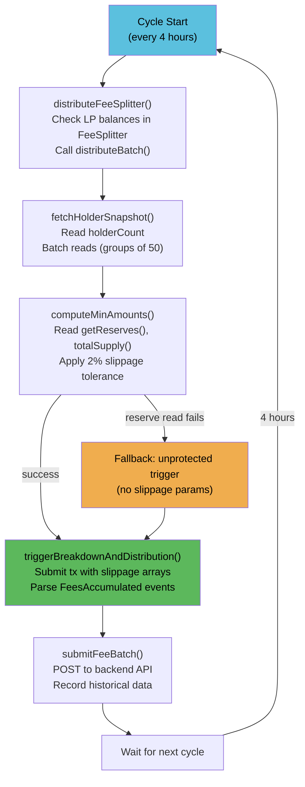

# Fee Listener v3

`scripts/feesListener_v3.js` is the off-chain service that automates the fee distribution pipeline. It runs as a systemd service and triggers fee processing every 4 hours.

## What It Does

Every cycle (default: 4 hours):

1. **FeeSplitter.distributeBatch()** — Routes accumulated protocol fee LP from FeeSplitter to FeeManager and LPVault
2. **Compute slippage bounds** — Reads on-chain reserves and total supply for each LP token to calculate expected output with 2% tolerance
3. **FeeManager.triggerBreakdownAndDistribution()** — Breaks LP into underlying tokens with slippage protection
4. **Snapshot holders** — Reads all DSFO holder balances in batches of 50
5. **Record to API** — Posts fee batch data to the backend for the frontend dashboard

## Cycle Flow



## Configuration

| Env Variable | Required | Default | Description |
|-------------|----------|---------|-------------|
| `FEE_MANAGER_ADDRESS` | Yes | — | FeeManagerV2 contract address |
| `FEE_SPLITTER_ADDRESS` | Yes | — | FeeSplitter contract address |
| `FEE_MANAGER_OWNER_KEY` | One of these | — | Private key for signing trigger txs |
| `MNEMONIC` | One of these | — | Alternative to private key (derives first account) |
| `FEE_LISTENER_API_BASE_URL` | No | `http://localhost:3002` | Backend API base URL for recording fee data |
| `FEES_LISTENER_INTERVAL_MS` | No | 14400000 (4h) | Poll interval in milliseconds |

## RPC Fallback

Uses viem's ranked fallback transport across 3 QuickNode endpoints:

```javascript
const RPC_URLS = [
  'https://quicknode1.peaq.xyz',
  'https://quicknode2.peaq.xyz',
  'https://quicknode3.peaq.xyz',
];
const transport = fallback(RPC_URLS.map((url) => http(url)), { rank: true });
```

viem automatically ranks endpoints by latency and switches on failure. If all endpoints fail, the cycle skips and retries on the next interval.

## Slippage Protection

Before calling `triggerBreakdownAndDistribution`, the listener computes expected output amounts from on-chain data:

```
For each registered LP token:
  1. Read pair.getReserves() -> (reserve0, reserve1)
  2. Read pair.totalSupply() -> totalLPSupply
  3. Read FeeManager LP balance -> lpBalance

  expectedAmount0 = (lpBalance * reserve0) / totalLPSupply
  expectedAmount1 = (lpBalance * reserve1) / totalLPSupply

  minAmount0 = expectedAmount0 - (expectedAmount0 * 2%)
  minAmount1 = expectedAmount1 - (expectedAmount1 * 2%)
```

This protects against sandwich attacks or large price movements between the read and the transaction.

**Fallback**: If any reserve read fails (RPC error, pair not found), the listener falls back to the unprotected overload (no slippage params). The trigger still executes but without sandwich protection.

## systemd Service

Deploy as a systemd service using `scripts/deploy/feeslistener-v3.service`:

```ini
[Unit]
Description=DonnySwap Fees Listener v3
After=network-online.target
Wants=network-online.target

[Service]
Type=simple
User=root
WorkingDirectory=/root/backend/DonnySwap
ExecStart=/usr/bin/node /root/backend/DonnySwap/scripts/feesListener_v3.js
Restart=always
RestartSec=30
EnvironmentFile=/root/backend/deployer/.env

# Hardening
NoNewPrivileges=true
ProtectSystem=strict
ReadWritePaths=/root/backend/DonnySwap

[Install]
WantedBy=multi-user.target
```

### Installation

```bash
sudo cp scripts/deploy/feeslistener-v3.service /etc/systemd/system/
sudo systemctl daemon-reload
sudo systemctl enable feeslistener-v3
sudo systemctl start feeslistener-v3
```

## Monitoring

### Live Logs

```bash
sudo journalctl -u feeslistener-v3 -f
```

### Service Status

```bash
sudo systemctl status feeslistener-v3
```

### Check Last Trigger Time

Read directly from the FeeManager contract:

```bash
cast call 0x852a62798B691eB5d8424169797b25e786DF4911 "lastTriggerTime()" --rpc-url https://quicknode1.peaq.xyz
```

### Check Pending Fees

Check if the FeeSplitter has accumulated fees to distribute:

```bash
# Check MRBL-PEAQ LP balance in FeeSplitter
cast call 0x6D4e72A465427b60EEd0F819e946d54A7FD98Bcd "balanceOf(address)" 0xe0a8AdBd3A9c780407A7993343589d7858CB1ba0 --rpc-url https://quicknode1.peaq.xyz
```

## Troubleshooting

### Service Won't Start

1. Check logs: `journalctl -u feeslistener-v3 --no-pager -n 50`
2. Verify `.env` file exists at the `EnvironmentFile` path
3. Verify private key has PEAQ for gas
4. Verify contract addresses in `.env` are correct

### Trigger Reverts with "Too soon"

The minimum interval (default 4 hours) hasn't elapsed since the last trigger. This is expected behavior — wait for the interval to pass or check if another caller (MEV bot, manual call) triggered recently.

### Trigger Reverts with Slippage Error

Large price movement between reserve read and transaction execution. The listener will automatically retry with the unprotected overload on the next cycle. If this happens frequently, consider increasing the slippage tolerance beyond 2%.

### RPC Errors

All three QuickNode endpoints may be down or rate-limited. Check:
```bash
curl -s -X POST https://quicknode1.peaq.xyz -H "Content-Type: application/json" -d '{"jsonrpc":"2.0","method":"eth_blockNumber","params":[],"id":1}'
```

The service auto-restarts after 30 seconds (systemd `RestartSec=30`), so transient RPC failures resolve on their own.

### No Fees Being Distributed

1. Verify `Factory.feeTo` points to FeeSplitter: check on Subscan
2. Verify trading is happening (check pair swap events)
3. Verify the listener's wallet has PEAQ for gas
4. Check if `triggerMinInterval` has been changed to a very long value

### Fees Stuck in FeeManager

If LP tokens are in FeeManager but not being broken down, check:
1. LP token is registered: call `isRegisteredLP(address)` on FeeManager
2. Router address is correct: call `router()` on FeeManager
3. LP balance exceeds `triggerMinLPBalance`
