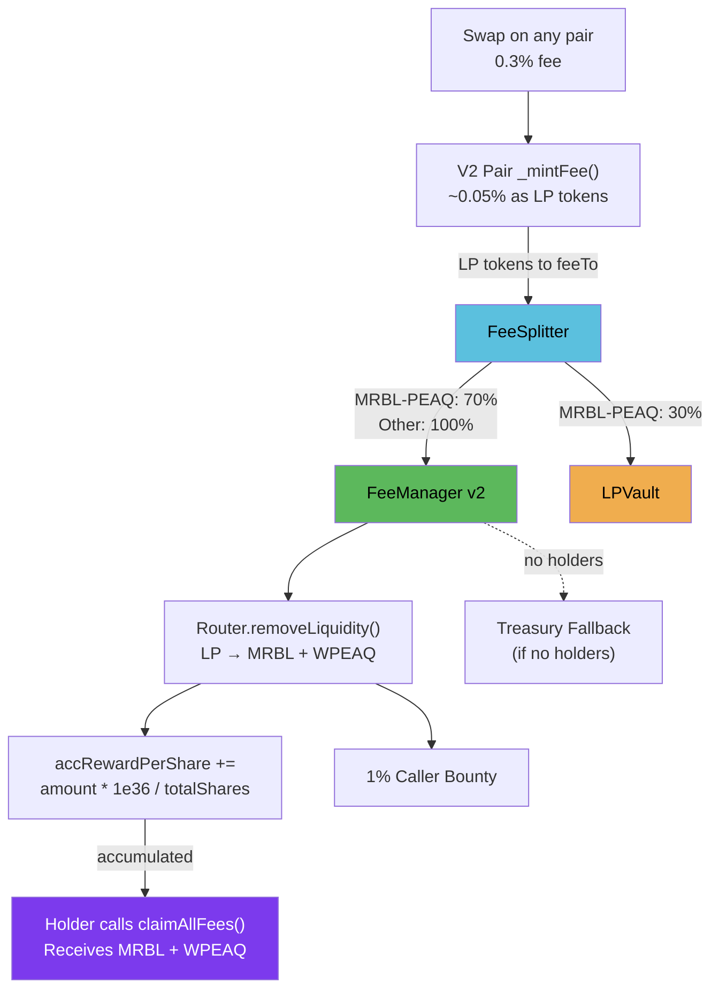

# Fee Distribution

DonnySwap uses a **claim-based** (MasterChef-style) fee distribution model. Fees accumulate per-share on-chain. Holders claim whenever they want — no gas-heavy distribution loops.

## Revenue Flow



### Step 1: Protocol Fee Generation

Every swap on any DonnySwap pair generates a 0.3% fee. Of that, approximately 0.05% is minted as LP tokens and sent to `Factory.feeTo` — which is the **FeeSplitter** contract.

This is mandatory and ubypassable. The V2 Pair contract's `_mintFee()` sends LP to the `feeTo` address regardless of which router or frontend the trader uses.

### Step 2: FeeSplitter Routing

The FeeSplitter examines each LP token it holds and routes it:

| LP Token Type | FeeManager | LPVault |
|--------------|-----------|---------|
| MRBL-PEAQ LP | 70% | 30% |
| All other LP | 100% | 0% |

The 30% MRBL-PEAQ LP going to LPVault strengthens the redemption backstop and generates harvest surplus.

### Step 3: FeeManager Breakdown

When `triggerBreakdownAndDistribution()` is called:

1. For each registered LP token held by FeeManager
2. Calls `Router.removeLiquidity()` to break LP into underlying tokens (e.g., MRBL + WPEAQ)
3. Deducts caller bounty (default 1%, capped)
4. Accumulates remaining tokens into `accRewardPerShare` (scaled by 1e36)

```solidity
accRewardPerShare[token] += (amount * PRECISION) / totalTrackedShares;
```

### Step 4: Claiming

DSFO holders call `claimAllFees()` or `claimFees(address[] tokens)` to withdraw accumulated rewards.

Claimable amount per holder per token:

```
claimable = (holderBalance * accRewardPerShare[token]) / PRECISION - rewardDebt[holder][token] + pendingRewards[holder][token]
```

## Two Revenue Streams for DSFO Holders

### Stream 1: Direct Fee Claims (FeeManager)

- Source: Protocol fees from all trading pairs
- Mechanism: `accRewardPerShare` accumulation
- Claim: `claimAllFees()` on FeeManager
- Frequency: Anytime (accumulates between claims)

### Stream 2: Vault Harvest Bonus (LPVault → FeeManager)

- Source: LPVault surplus above target
- Mechanism: `harvest()` sends DSFO bonus LP to FeeManager
- The LP is then broken down in the next trigger cycle
- This is additional income on top of direct trading fees

## Trigger Configuration

The trigger is permissionless — anyone can call it:

| Parameter | Default | Description |
|-----------|---------|-------------|
| `triggerMinInterval` | 4 hours | Minimum time between triggers |
| `triggerBountyBps` | 100 (1%) | Caller incentive as % of output |
| `triggerBountyCap` | Set by governance | Max absolute bounty per token |
| `triggerMinLPBalance` | 0 | Minimum LP to prevent dust griefing |

## Treasury Fallback

When `totalTrackedShares == 0` (no DSFO holders), triggering sends all LP to the treasury address instead of reverting. This prevents fees from getting stuck.
