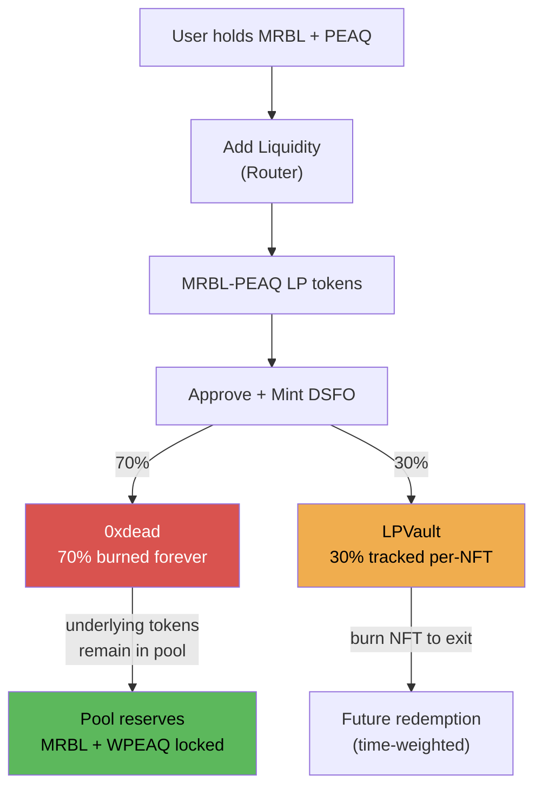

# LP Mechanics

When a user mints DSFO NFTs, they pay with **MRBL-PEAQ LP tokens**. These LP tokens are split:

## The 70/30 Split

| Destination | Share | What Happens |
|-------------|-------|-------------|
| Burn (`0xdead`) | 70% | LP tokens sent to dead address. The underlying MRBL + WPEAQ remain locked in the pool **forever**. This is permanent, protocol-owned liquidity. |
| LPVault | 30% | LP tokens deposited and tracked per-NFT. Backs future redemptions and generates harvest surplus. |

The split ratio is adjustable by governance via `setBurnVaultSplit(burnBps, vaultBps)` — must sum to 10000.

## What "Burning LP" Actually Means

Sending LP tokens to `0xdead` does not destroy the underlying tokens. It:

1. Removes those LP tokens from circulation (no one can redeem them)
2. The MRBL and WPEAQ inside remain in the pool's reserves
3. This permanently deepens the liquidity pool
4. All future swaps benefit from deeper liquidity (less slippage)
5. The locked MRBL effectively reduces free-floating MRBL supply

## LPVault Deposits

For each NFT in a batch mint, the vault records:

```solidity
struct MintRecord {
    uint256 mintCostLP;    // LP tokens deposited for this NFT
    uint256 mintTimestamp; // Block timestamp at mint
}
```

This per-NFT record enables:
- **Time-weighted redemption**: Earlier mints get more back sooner
- **Individual redemption**: Each NFT can be redeemed independently
- **Vault target tracking**: `totalActiveMintCost` adjusts on every mint/redeem

## LP Flow Diagram



## MRBL Indirect Deflation

Since MRBL is one of the two tokens inside the LP pair:

- Each DSFO mint locks MRBL inside the pool (via LP burn)
- More minting → less free-floating MRBL → MRBL becomes scarcer
- Scarcer MRBL → higher DSFO mint cost → natural supply throttle
- This creates a self-regulating supply/demand loop
