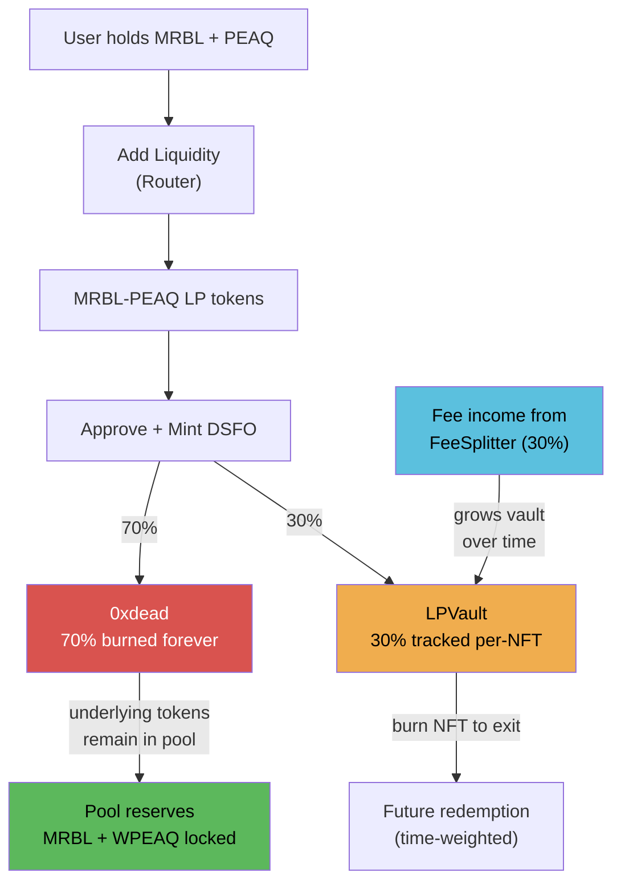

# LP Mechanics

When a user mints DSFO NFTs, they pay with **MRBL-PEAQ LP tokens**. These LP tokens are split:

## The 70/30 Split

| Destination | Share | What Happens |
|-------------|-------|-------------|
| Burn (`0xdead`) | 70% | LP tokens sent to dead address. The underlying MRBL + WPEAQ remain locked in the pool **forever**. This is permanent, protocol-owned liquidity. |
| LPVault | 30% | LP tokens deposited and tracked per-NFT. Backs future redemptions and generates harvest surplus. |

The split ratio is adjustable by the owner via `setBurnVaultSplit(burnBps, vaultBps)` — must sum to 10000.

## What "Burning LP" Actually Means

Sending LP tokens to `0xdead` does not destroy the underlying tokens. It:

1. **Removes those LP tokens from circulation** — No one can ever redeem them for the underlying assets
2. **The MRBL and WPEAQ inside remain in the pool's reserves** — They still provide liquidity for trades
3. **Permanently deepens the liquidity pool** — More reserves = less slippage for traders
4. **Benefits all traders on every future swap** — Deeper pools mean better execution prices
5. **Effectively reduces circulating MRBL supply** — The locked MRBL cannot be accessed by anyone

### Why Burn and Not Lock?

Sending to `0xdead` is simpler and more trustless than a timelock contract:
- No governance key can unlock it
- No upgrade can recover it
- No multisig can vote to release it
- It's verifiable on-chain — anyone can check the dead address balance

## Worked Mint Example

Alice wants to mint 3 DSFO NFTs. Current `activeSupply = 10`, `basePrice = 0.1 LP`, `priceStep = 0.01 LP`.

**Step 1: Calculate batch cost**

```
NFT #11: 0.1 + (10 * 0.01) = 0.20 LP
NFT #12: 0.1 + (11 * 0.01) = 0.21 LP
NFT #13: 0.1 + (12 * 0.01) = 0.22 LP
Total cost: 0.63 LP
```

**Step 2: Alice approves and calls `mint(3)`**

**Step 3: LP is split**

```
Burned (70%):   0.63 * 0.7 = 0.441 LP -> sent to 0xdead
Vault (30%):    0.63 - 0.441 = 0.189 LP -> split across 3 MintRecords

Per-NFT vault deposits:
  Token #11: 0.063 LP (0.20 * 30%)
  Token #12: 0.063 LP (0.21 * 30%)
  Token #13: 0.063 LP (0.22 * 30%, absorbs remainder dust)
```

**Step 4: After mint**

- `activeSupply` = 13
- Next mint price = 0.1 + (13 * 0.01) = 0.23 LP
- FeeManager notified of Alice's 3 new shares
- 0.441 LP of MRBL + WPEAQ is permanently locked in the pool

## LPVault Deposits

For each NFT in a batch mint, the vault records:

```solidity
struct MintRecord {
    uint256 mintCostLP;    // LP tokens deposited for this NFT
    uint256 mintTimestamp; // Block timestamp at mint
}
```

This per-NFT record enables:

- **Time-weighted redemption**: Earlier mints get more back sooner (longer hold time)
- **Individual redemption**: Each NFT can be redeemed independently — you don't have to exit all at once
- **Vault target tracking**: `totalActiveMintCost` adjusts on every mint/redeem, keeping the harvest system calibrated
- **Preview function**: Anyone can call `previewRedemption(tokenId)` to see exact return values before committing

## LP Flow Diagram



## How the Vault Grows

The vault doesn't just hold the 30% from mints — it also receives:

1. **30% of MRBL-PEAQ protocol fees** via FeeSplitter
2. **50% of redemption fees** (the other 50% is burned)
3. **Retained harvest surplus** (60-95% depending on vault health tier)

This means the vault balance can grow well beyond the initial 30% deposits, improving redemption values for long-term holders.

## MRBL Indirect Deflation

Since MRBL is one of the two tokens inside the LP pair:

- Each DSFO mint locks MRBL inside the pool (via LP burn)
- More minting -> less free-floating MRBL -> MRBL becomes scarcer
- Scarcer MRBL -> higher DSFO mint cost (LP tokens are worth more in MRBL terms) -> natural supply throttle
- This creates a self-regulating supply/demand loop

### Quantifying the Effect

With 1M total MRBL supply, if 500 NFTs are minted and the average mint cost represents 100 MRBL worth of LP:

```
MRBL locked from burns: 500 * 100 * 70% = 35,000 MRBL
Free-floating MRBL reduced by: 3.5% of total supply
```

As the pool composition shifts, each unit of LP represents more MRBL (because MRBL is scarcer in the pool). This makes future mints more expensive in MRBL terms, even if the LP-denominated price hasn't changed much.

## Dust Handling

During batch mints, the last NFT in the batch absorbs any rounding dust from the vault split:

```solidity
if (i == quantity - 1) {
    // Last NFT absorbs remainder to avoid dust
    perNftVault = remainingVaultAmount;
}
```

This ensures no LP tokens are left stranded in the DSFO contract from rounding errors.
