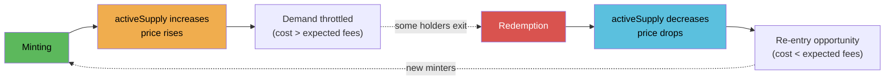

# Pricing Curve

DSFO NFTs use a linear bonding curve based on **active supply** (living NFTs, not total ever minted).

## Formula

```
price = basePrice + (activeSupply * priceStep)
```

- `basePrice` — Floor price in LP tokens (wei). Set at deployment, adjustable by governance.
- `priceStep` — Price increment per living NFT (wei). Set at deployment, adjustable by governance.
- `activeSupply` — Count of non-redeemed NFTs. Decreases on burn, increases on mint.

## Batch Pricing

When minting multiple NFTs in one transaction, each subsequent NFT in the batch costs more:

```solidity
function batchMintPrice(uint256 quantity) public view returns (uint256) {
    uint256 total = 0;
    uint256 supply = activeSupply;
    for (uint256 i = 0; i < quantity; i++) {
        total += basePrice + (supply * priceStep);
        supply++;
    }
    return total;
}
```

For a batch of `n` NFTs starting at supply `s`:

```
batchCost = n * basePrice + priceStep * (n*s + n*(n-1)/2)
```

## Supply-Price Feedback Loop



## Dynamic Supply Effects

The use of `activeSupply` instead of a monotonic counter creates a breathing market:

- **Minting** raises `activeSupply` → next NFT costs more → natural demand throttle
- **Redemption** burns NFT, lowers `activeSupply` → price drops → creates re-entry points
- **Equilibrium** emerges where mint cost ≈ expected fee income over hold period

## Constraints

- Maximum 50 NFTs per mint transaction
- Optional per-address mint cap (`maxMintsPerAddress`). 0 = unlimited. Owner is exempt.
- Payment is in MRBL-PEAQ LP tokens (not raw MRBL or PEAQ)

## Admin Parameters

| Parameter | Function | Default |
|-----------|----------|---------|
| `basePrice` | `setPricing(uint256, uint256)` | Set at deploy |
| `priceStep` | `setPricing(uint256, uint256)` | Set at deploy |
| `maxMintsPerAddress` | `setMaxMintsPerAddress(uint256)` | 0 (unlimited) |
