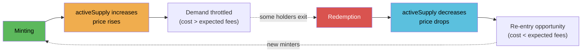

# Pricing Curve

DSFO NFTs use a linear bonding curve based on **active supply** (living NFTs, not total ever minted).

## Formula

```
price = basePrice + (activeSupply * priceStep)
```

- `basePrice` — Floor price in LP tokens (wei). Set at deployment, adjustable by owner.
- `priceStep` — Price increment per living NFT (wei). Set at deployment, adjustable by owner.
- `activeSupply` — Count of non-redeemed NFTs. Decreases on burn, increases on mint.

## Worked Example

Suppose `basePrice = 0.1 LP` and `priceStep = 0.01 LP`, with 10 active NFTs:

| NFT # | Active Supply Before | Price (LP) |
|-------|---------------------|------------|
| 11th | 10 | 0.1 + (10 * 0.01) = **0.20** |
| 12th | 11 | 0.1 + (11 * 0.01) = **0.21** |
| 13th | 12 | 0.1 + (12 * 0.01) = **0.22** |
| 20th | 19 | 0.1 + (19 * 0.01) = **0.29** |
| 50th | 49 | 0.1 + (49 * 0.01) = **0.59** |
| 100th | 99 | 0.1 + (99 * 0.01) = **1.09** |

The price increases linearly. At 100 active NFTs the mint cost is roughly 10x the base price.

Now if 30 holders redeem (activeSupply drops from 100 to 70):

```
Next mint price = 0.1 + (70 * 0.01) = 0.80 LP
```

The price dropped, creating re-entry opportunity — but the 30 who redeemed lost 70% of their LP to burns, making the cycle net-negative for extractors.

## Batch Pricing

When minting multiple NFTs in one transaction, each subsequent NFT in the batch costs more:

```solidity
function batchMintPrice(uint256 quantity) public view returns (uint256) {
    uint256 total = 0;
    uint256 supply = activeSupply;
    for (uint256 i = 0; i < quantity; i++) {
        total += basePrice + (supply * priceStep);
        supply++;
    }
    return total;
}
```

### Closed-Form Batch Formula

For a batch of `n` NFTs starting at active supply `s`:

```
batchCost = n * basePrice + priceStep * (n*s + n*(n-1)/2)
```

**Example**: Minting 5 NFTs starting at supply 10, with basePrice=0.1, priceStep=0.01:

```
batchCost = 5 * 0.1 + 0.01 * (5*10 + 5*4/2)
         = 0.5 + 0.01 * (50 + 10)
         = 0.5 + 0.6
         = 1.1 LP total
```

Individual prices: 0.20 + 0.21 + 0.22 + 0.23 + 0.24 = 1.10 LP (matches).

## Supply-Price Feedback Loop



## Dynamic Supply Effects

The use of `activeSupply` instead of a monotonic counter creates a breathing market:

- **Minting** raises `activeSupply` -> next NFT costs more -> natural demand throttle
- **Redemption** burns NFT, lowers `activeSupply` -> price drops -> creates re-entry points
- **Equilibrium** emerges where mint cost ~ expected fee income over hold period

### Why Not a Monotonic Counter?

A monotonic counter (total minted, never decreasing) would mean prices only go up. This creates two problems:

1. **No re-entry** — Late entrants pay permanently inflated prices even after mass redemptions
2. **Dead protocol** — If most holders leave, new mints are priced as if the protocol is thriving

Active supply reflects reality: if holders leave, the protocol is smaller and prices should reflect that.

## Equilibrium Dynamics

Rational actors mint when:

```
Expected fee income over hold period > Mint cost - Expected redemption value
```

Since 70% of mint cost is permanently burned and max redemption is ~29.1% of mint cost (after fees), the breakeven is roughly:

```
Expected fees > 70.9% of mint cost
```

This creates a natural ceiling on supply — when there are too many holders splitting fees, the expected return drops below cost and minting stops.

## Constraints

- Maximum **50 NFTs** per mint transaction (gas limit protection)
- Optional per-address mint cap (`maxMintsPerAddress`). 0 = unlimited. Owner is exempt.
- Payment is in **MRBL-PEAQ LP tokens** (not raw MRBL or PEAQ)
- `basePrice` must be > 0 (enforced in constructor and `setPricing`)

## Admin Parameters

| Parameter | Function | Default | Constraints |
|-----------|----------|---------|-------------|
| `basePrice` | `setPricing(uint256, uint256)` | Set at deploy | Must be > 0 |
| `priceStep` | `setPricing(uint256, uint256)` | Set at deploy | — |
| `maxMintsPerAddress` | `setMaxMintsPerAddress(uint256)` | 0 (unlimited) | Owner exempt |
