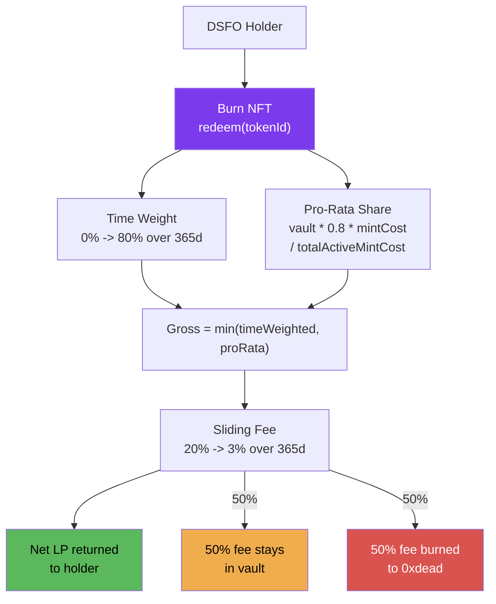

# Redemption

DSFO NFTs are soulbound — the only way to exit is to **burn** the NFT and redeem LP tokens from the LPVault.

## Redemption Flow



## Redemption Formula

```
grossRedemption = min(timeWeightedAmount, vaultProRataShare)
fee = grossRedemption * feeBps / 10000
netRedemption = grossRedemption - fee
```

Three independent calculations determine what you get back:

### 1. Time Weight (0% -> 80% over 365 days)

How long you've held determines the maximum percentage of your mint cost you can reclaim:

```solidity
if (daysSinceMint >= 365 days) {
    timeWeightBps = 8000; // 80% cap
} else {
    timeWeightBps = (8000 * daysSinceMint) / 365 days;
}
timeWeightedAmount = (mintCostLP * timeWeightBps) / 10000;
```

| Days Held | Time Weight | Eligible LP (of mint cost) |
|-----------|-------------|---------------------------|
| 0 | 0.0% | 0.00 LP |
| 7 | 1.5% | 0.015 LP per 1 LP cost |
| 30 | 6.6% | 0.066 LP |
| 90 | 19.7% | 0.197 LP |
| 180 | 39.5% | 0.395 LP |
| 270 | 59.2% | 0.592 LP |
| 365+ | 80.0% | 0.800 LP (maximum) |

The cap is 80%, not 100%, because only 30% of your mint cost went to the vault. The remaining 20% gap (between the 30% deposited and 80% time weight) can only be reached if the vault has grown from fee deposits.

### 2. Pro-Rata with 20% Reserve

Your share of the vault, with a 20% reserve held back:

```solidity
vaultProRata = (currentVaultBalance * 8000 * mintCostLP) / (10000 * totalActiveMintCost);
```

The `0.8` multiplier (8000 bps) ensures 20% of the vault always remains, regardless of redemption ordering. This is a **deterministic reserve** — not a threshold that can be drained.

**Example**: Vault holds 100 LP. Total active mint costs = 300 LP. Your NFT cost 1 LP.

```
vaultProRata = (100 * 8000 * 1) / (10000 * 300) = 0.267 LP
```

### 3. Gross Redemption

The actual gross payout is the **minimum** of time weight and pro-rata:

```
grossRedemption = min(timeWeightedAmount, vaultProRata)
```

- If the vault is **healthy** (balance >= target), time weight is usually the binding constraint
- If the vault is **depleted**, pro-rata becomes the binding constraint, protecting remaining holders

### 4. Sliding Fee (20% -> 3% over 365 days)

A fee is charged on the gross amount, decreasing over time:

```solidity
if (daysSinceMint >= 365 days) {
    feeBps = 300; // 3% minimum
} else {
    feeBps = 2000 - (1700 * daysSinceMint) / 365 days;
    if (feeBps < 300) feeBps = 300;
}
fee = (grossRedemption * feeBps) / 10000;
```

| Days Held | Fee Rate | Effective Cost |
|-----------|----------|---------------|
| 0 | 20.0% | Highest — strong deterrent |
| 30 | 18.6% | Still expensive |
| 90 | 15.3% | Moderate |
| 180 | 11.6% | Declining |
| 270 | 7.9% | Low |
| 365+ | 3.0% | Minimum floor |

### 5. Fee Split

The redemption fee is split 50/50:

- **50% stays in vault** — benefits remaining holders by increasing their pro-rata share
- **50% burned** (sent to `0xdead`) — permanently locks more liquidity in the pool

## Worked Redemption Scenarios

### Scenario A: Early Exit (Day 30)

Alice minted 1 NFT for 1.0 LP. Vault is healthy.

```
Time weight:  6.6% * 1.0 LP = 0.066 LP
Pro-rata:     (assuming healthy) ~0.267 LP
Gross:        min(0.066, 0.267) = 0.066 LP  (time weight is binding)

Fee rate:     18.6%
Fee:          0.066 * 0.186 = 0.0123 LP
  -> 0.0061 LP stays in vault
  -> 0.0061 LP burned

Net returned: 0.066 - 0.0123 = 0.0537 LP
```

Alice gets back 5.4% of her mint cost. The other 94.6% is split between permanent burns (70% at mint + fee burn) and the vault.

### Scenario B: Full Term (Day 365)

Bob minted 1 NFT for 1.0 LP. Vault is healthy.

```
Time weight:  80% * 1.0 LP = 0.80 LP
Pro-rata:     (assuming healthy vault) ~0.267 LP
Gross:        min(0.80, 0.267) = 0.267 LP  (pro-rata is binding)

Fee rate:     3%
Fee:          0.267 * 0.03 = 0.008 LP
  -> 0.004 LP stays in vault
  -> 0.004 LP burned

Net returned: 0.267 - 0.008 = 0.259 LP
```

Bob gets back ~25.9% of his mint cost. Combined with a year of fee claims, this may exceed his original investment.

### Scenario C: Depleted Vault

Carol minted 1 NFT for 1.0 LP at day 365, but the vault has been depleted (balance = 20 LP, total active costs = 300 LP):

```
Time weight:  80% * 1.0 LP = 0.80 LP
Pro-rata:     (20 * 0.8 * 1.0) / 300 = 0.053 LP
Gross:        min(0.80, 0.053) = 0.053 LP  (pro-rata is binding due to low vault)

Fee:          0.053 * 0.03 = 0.0016 LP
Net returned: 0.053 - 0.0016 = 0.051 LP
```

The vault protects itself — Carol gets less because there's less to go around, but the 20% reserve ensures the vault never fully drains.

## Best-Case Redemption (Day 365+, Healthy Vault)

Starting with mint cost `P`, 30% went to vault (0.3P per NFT):

```
Time weight: 80% of P = 0.8P
Pro-rata:    80% of vault share
Gross:       limited by the smaller of the two
Fee:         3%
Net:         up to ~29.1% of P returned (from the 30% vault deposit)
```

The remaining ~70.9% was burned forever. **Fee income earned during the hold period is the primary return**, not the redemption.

## Constraints

- **48-hour cooldown** between redemptions per address (prevents bot-driven vault drainage)
- **Soulbound**: Cannot transfer NFT to another address — must redeem from minting address
- **Cannot redeem while paused**
- **Batch limit**: Up to 50 NFTs per `redeemBatch()` call
- **No partial redemption**: Each NFT is fully redeemed or not at all

## Preview Function

Use `LPVault.previewRedemption(tokenId)` to see exact redemption values before committing:

```solidity
function previewRedemption(uint256 tokenId) external view returns (
    uint256 grossAmount,  // Before fee
    uint256 fee,          // Fee amount
    uint256 netAmount,    // After fee (what you receive)
    uint256 timeWeightBps, // Current time weight in bps
    uint256 feeBps        // Current fee rate in bps
)
```

Returns `(0, 0, 0, 0, 0)` if the token has no mint record (already redeemed or invalid).

## Batch Redemption

`DSFONFTv3.redeemBatch(uint256[] tokenIds)` allows redeeming up to 50 NFTs in a single transaction. Each NFT is processed independently with its own time weight and fee calculation. The 48-hour cooldown applies per-address, so the cooldown timer resets once for the entire batch.
