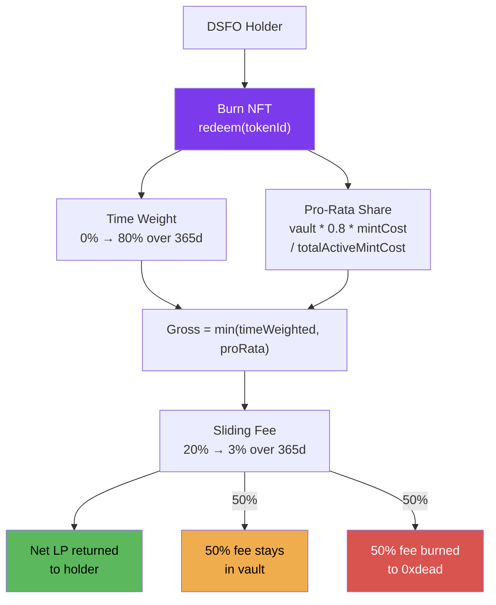

# Redemption

DSFO NFTs are soulbound — the only way to exit is to **burn** the NFT and redeem LP tokens from the LPVault.

## Redemption Flow



## Redemption Formula

```
grossRedemption = min(timeWeightedAmount, vaultProRataShare)
fee = grossRedemption * feeBps / 10000
netRedemption = grossRedemption - fee
```

### Time Weight (0% → 80% over 365 days)

```
timeWeightBps = min(8000, 8000 * daysSinceMint / 365)
timeWeightedAmount = mintCostLP * timeWeightBps / 10000
```

| Days Held | Time Weight | % of Mint Cost Eligible |
|-----------|-------------|------------------------|
| 0 | 0% | 0% |
| 30 | 6.6% | 6.6% |
| 90 | 19.7% | 19.7% |
| 180 | 39.5% | 39.5% |
| 365+ | 80% | 80% (max) |

### Pro-Rata with 20% Reserve

```
vaultProRata = (vaultBalance * 0.8 * mintCostLP) / totalActiveMintCost
```

The 20% reserve is baked into the formula — deterministic regardless of redemption ordering. No race conditions.

### Sliding Fee (20% → 3% over 365 days)

```
feeBps = max(300, 2000 - 1700 * min(daysSinceMint, 365) / 365)
```

| Days Held | Fee Rate |
|-----------|----------|
| 0 | 20% |
| 30 | 18.6% |
| 90 | 15.3% |
| 180 | 11.6% |
| 365+ | 3% (min) |

### Fee Split

The redemption fee is split:
- **50% stays in vault** — benefits remaining holders
- **50% burned** (sent to `0xdead`) — permanently locks more liquidity

## Best-Case Redemption (Day 365+)

Starting with mint cost `P`:

```
Time weight: 80% of P
Pro-rata: 80% of vault share (if vault is healthy)
Gross: min(0.8P, proRata)
Fee: 3%
Net: up to ~29.1% of P returned (from the 30% vault deposit)
```

The remaining ~70.9% was burned forever. Fee income earned during the hold period is the reward for that cost.

## Constraints

- **48-hour cooldown** between redemptions per address
- **Soulbound**: Cannot transfer NFT to another address — must redeem from minting address
- **Cannot redeem while paused**

## Preview Function

Use `LPVault.previewRedemption(tokenId)` to see exact redemption values before committing:

```solidity
function previewRedemption(uint256 tokenId) external view returns (
    uint256 grossAmount,
    uint256 fee,
    uint256 netAmount,
    uint256 timeWeightBps,
    uint256 feeBps
)
```

## Batch Redemption

`DSFONFTv3.redeemBatch(uint256[] tokenIds)` allows redeeming up to 50 NFTs in a single transaction.
